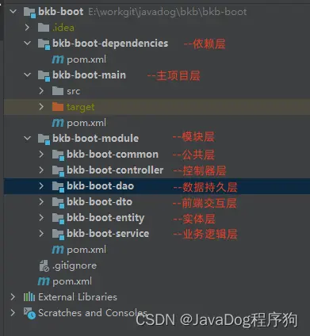

# JDK17 SpringBoot3 脚手架

数据持久层：Mapper

实体层：数据库表对应的实体

Common层：Common层通常包括一些通用的工具类和方法，如日期处理、加密解密等。

MyBatis-Plus文档：https://baomidou.com/guides/new-code-generator/

docker pull mysql:latest  这将下载最新版本的MySQL镜像。

docker run --name root -e MYSQL_ROOT_PASSWORD=123456 -p 3306:3306 -v ~/Docker/db/mysql/8.4.2:/var/lib/mysql -d mysql:8.4.2

docker stop my-mysql-container 停止容器

docker rm my-mysql-container 删除容器

docker exec -it a5c14 bash 已bash的方式进入mysql

mysql -u root -p  登录数据库

create database springbootdemo charset=utf8; 创建数据库

CREATE DATABASE mydatabase; 创建数据库

use mydatabase; 选择数据库

  
